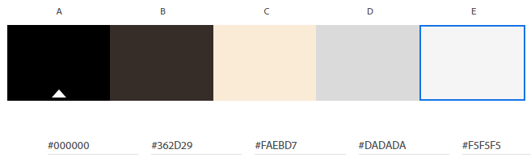

# The Pastry Palette

## Introduction

Welcome to The Pastry Palette's official website!
This virtual space has been carefully crafted with both new and cherished customers of The Pastry Palette in mind. Here, we invite you to explore the world of heavenly aromas, irresistible flavors, and artisanal creations that define our bakery's essence.

Link to site : [The-Pastry-Palette](https://terrabite147.github.io/the-pastry-palette/)

## Contents

- [Introduction](#introduction)
- [User Experience](#user-experience)
    - [Intended Users](#intended-users)
    - [Wireframes](#wireframes)
- [Design](#design)
- [Features](#features)
    - [Nav](#nav)
    - [Home](#home)
    - [Menu](#menu)
    - [About Us](#about-us)
    - [Contact and Location](#contact-and-location)
    - [Survey](#survey)
- [Testing](#testing)
    - [Desktop](#desktop)
    - [Mobile](#mobile)
    - [Browsers](#browsers)
        - [Edge](#edge)
        - [Chrome](#chrome)
        - [Firefox](#firefox)

#

## User Experience
### Intended Users
This site is intended for:

- New Customers
- Existing Customers
- Customers wanting to see what is available and where to find The Pastry Palette

### Wireframes

 Desktop - Home :
 The below displays the layout of the Header, Hero Section, Call to action and Menu Section.

Desktop - Infomation Section :
The below displays the layout of the About us, Contact Section and Footer.

Desktop - Survey :
The below displays the layout of the Survey page.

Mobile - Home :
The below displays the layout of the header, Hero and Call to Action scaled to 320px.

Mobile - Home :
The below displays the layout of the header, Hero and Call to Action.

### Design
- Font
    - Rock Salt was used for the title of The Pastry Palette.
    - Lato was used for the Header, footer and all text.
    - sans-serif was used as the secondary font for all text.

- Color scheme

    The Color Scheme was based off of the [Hero Image](https://www.freepik.com/premium-photo/horizontal-photo-homemade-chocolate-cookies-dark-table_2654616.htm) 
    

#
## Features
- ### nav

- ### Home
- ### Menu 
- ### about us 
- ### Contact and Location
- ### Survey

## Testing

- ### desktop 
- ### mobile 

- ### browsers
    - #### edge
    - #### chrome
    - #### firefox

- ### Lighthouse results 

- ### w3c code Validator  

- ### bugs

## deployment

## Credit

### Images

https://www.freepik.com/premium-photo/horizontal-photo-homemade-chocolate-cookies-dark-table_2654616.htm Hero Image

 https://pixabay.com/photos/ciabatta-bread-baked-baker-food-1589083/ Ciabata

 https://pixabay.com/photos/french-coarse-country-bread-bread-1613878/ French Coarse

 https://pixabay.com/photos/bread-baker-crafts-food-oven-eat-2667075/ Sourdough

 https://pixabay.com/photos/macaroons-macro-cookies-dessert-3311851/ Macaroons

 https://pixabay.com/photos/chocolate-bread-breakfast-croissant-5087206/ Pain Au Chocolat

 https://pixabay.com/photos/cinnamon-rolls-bread-spiral-baking-1417494/ Cinnamon Rolls

 ### Code
 