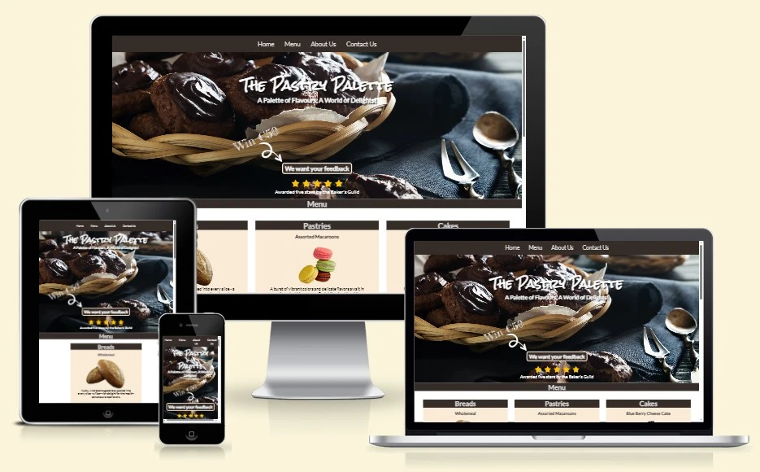

# The Pastry Palette

## Introduction

Welcome to The Pastry Palette's official website!
This virtual space has been carefully crafted with both new and cherished customers of The Pastry Palette in mind. Here, we invite you to explore the world of heavenly aromas, irresistible flavors, and artisanal creations that define our bakery's essence.

Link to site : [The-Pastry-Palette](https://terrabite147.github.io/the-pastry-palette/)

## Contents

- [Introduction](#introduction)
- [User Experience](#user-experience)
    - [Intended Users](#intended-users)

## User Experience
### Intended Users

This site is intended for:

- New Customers
- Existing Customers
- Customers wanting to see what is available and where to find The Pastry Palette

### Wireframes
- Desktop
- Mobile

### design
- color scheme

## Features
- nav
- Home
- Menu 
- about us 
- Contact and Location

## Testing

- desktop 
- mobile 

-browser
 - edge
 - chrome
 - firefox

 - test named features

- Lighthouse results 
- w3c code Validator  

- bugs

## deployment

## Credit

### Images

 https://pixabay.com/photos/ciabatta-bread-baked-baker-food-1589083/ Ciabata

 https://pixabay.com/photos/french-coarse-country-bread-bread-1613878/ French Coarse

 https://pixabay.com/photos/bread-baker-crafts-food-oven-eat-2667075/ Sourdough

 https://pixabay.com/photos/macaroons-macro-cookies-dessert-3311851/ Macaroons

 https://pixabay.com/photos/chocolate-bread-breakfast-croissant-5087206/ Pain Au Chocolat

 https://pixabay.com/photos/cinnamon-rolls-bread-spiral-baking-1417494/ Cinnamon Rolls

 ### Code
 