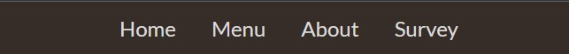

# The Pastry Palette

## Introduction

Welcome to The Pastry Palette's official website!
This virtual space has been carefully crafted with both new and cherished customers of The Pastry Palette in mind. Here, we invite you to explore the world of heavenly aromas, irresistible flavors, and artisanal creations that define our bakery's essence.

Link to site : [The Pastry Palette](https://terrabite147.github.io/the-pastry-palette/)

## Contents

- [Introduction](#introduction)
- [User Experience](#user-experience)
    - [Intended Users](#intended-users)
    - [Wireframes](#wireframes)
- [Design](#design)
- [Features](#features)
    - [Nav](#nav)
    - [Home](#home)
    - [Menu](#menu)
    - [About Us](#about-us)
    - [Survey](#survey)
- [Testing](#testing)
    - [Desktop](#desktop)
    - [Mobile](#mobile)
    - [Browsers](#browsers)
        - [Edge](#edge)
        - [Chrome](#chrome)
        - [Firefox](#firefox)

#

## User Experience
### Intended Users
This site is intended for:

- New Customers
- Existing Customers
- Customers wanting to see what is available and where to find The Pastry Palette

### Wireframes

 Desktop - Home :
 The below displays the layout of the Header, Hero Section, Call to action and Menu Section.

Desktop - Information Section :
The below displays the layout of the About us, Contact Section and Footer.

Desktop - Survey : The below displays the layout of the Survey page.

Mobile - Home :
The below displays the layout of the header, Hero and Call to Action scaled to 320px.

Mobile - Menu :
The below displays the layout of the header, Hero and Call to Action.

### Design
- Font
    - Rock Salt was used for the title of The Pastry Palette.
    - git was used for the Header, footer and all text.
    - sans-serif was used as the secondary font for all text.

- Color scheme

    The Color Scheme was based off of the [Hero Image](https://www.freepik.com/premium-photo/horizontal-photo-homemade-chocolate-cookies-dark-table_2654616.htm) 

    
    
    
    
    

#
## Features
- ### nav
    - The header consists of a fix nav bar intended to stay at top of the screen during navigation. A logo or title was not necessary as the title is visible of the Hero section.
    - The nav font size will scale down with the screen size to make it clear and responsive at all sizes.
    - The links will change from  to  when hovered over to indicate a clickable link.

- ### Home
    - The home section consists of the Hero image, a call to action to click on the survey link and an award given to the bakery.
    - This section aims to be inviting and show the quality and style of The Pastry Palette.
    
- ### Menu 
    - The menu section is presented to the user to show what type of products The Pastry Palette offers.
    - The menu section consists of 3 columns each with their own category of product.
    - Each product has a title and a short description to better showcase the product.
    

    - At medium resolutions the menu section will form a column  and the content will form a row.
    

    - At mobile resolutions the menu section will form a column and the content will be in a column.
    
- ### about us 
    - The about us section is designed to show customers the people behind The Pastry Palette, a brief history of the bakery and the location(s).

    -  The google map has been added to assist with directions and the hours and contact info is shown for enquires.
         

    - The About us section is designed to form a single column at mobile resolutions.

        

- ### Survey
    - The Survey section is designed to gather feed back and potential online ordering feasibility 
    - The Head and Footer follow the same lay-out as all other pages.
     

    
    

## Testing

- ### desktop 
- ### mobile 

- ### browsers
    - #### edge
    - #### chrome
    - #### firefox

- ### Lighthouse results 

- ### w3c code Validator  

- ### bugs

## deployment

## Credit

### Images

https://www.freepik.com/premium-photo/horizontal-photo-homemade-chocolate-cookies-dark-table_2654616.htm Hero Image

 https://pixabay.com/photos/ciabatta-bread-baked-baker-food-1589083/ Ciabata

 https://pixabay.com/photos/french-coarse-country-bread-bread-1613878/ French Coarse

 https://pixabay.com/photos/bread-baker-crafts-food-oven-eat-2667075/ Sourdough

 https://pixabay.com/photos/macaroons-macro-cookies-dessert-3311851/ Macaroons

 https://pixabay.com/photos/chocolate-bread-breakfast-croissant-5087206/ Pain Au Chocolat

 https://pixabay.com/photos/cinnamon-rolls-bread-spiral-baking-1417494/ Cinnamon Rolls

 ### Code
 